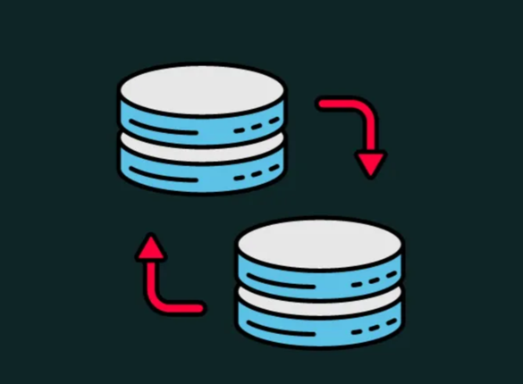

<a name="readme-top"></a>

<div align="center">

<a href="https://github.com/jesusalbujas/postgres_replication">  </a>

# Replicación de Base de Datos PostgreSQL
Este repositorio ofrece y detalla dos configuraciones de despliegue utilizando Docker Compose y PostgreSQL 13 para implementar la replicación de bases de datos PostgreSQL. El método empleado es replicación en streaming, que permite transferir datos de forma continua desde el servidor principal (master) hacia los servidores secundarios (esclavos), asegurando la sincronización en tiempo real. 
</div>

## Despliegues Docker Compose

Este repositorio define dos despliegues, siendo [`postgres13-master`](https://github.com/jesusalbujas/postgres_replication/tree/main/postgres13-master) el despliegue principal que albergará las bases de datos.

Por otro lado, contamos con [`postgres13-slave`](https://github.com/jesusalbujas/postgres_replication/tree/main/postgres13-slave), que actúa como el servidor esclavo encargado de recibir y replicar los cambios realizados en el servidor master (**postgres13-master**).

## Definición de Docker Composes

### PostgreSQL 13 - Master

A continuación se detalla lo que contiene cada directorio

**config**: Este directorio contiene un script en shell diseñado para validar la conexión entre el servidor maestro y el esclavo. Al ejecutarlo, proporciona información sobre el estado del slot de replicación. La columna `active` devuelve `t` si el slot de replicación está activo, o `f` en caso contrario.

---

**postgresql**:

- pg_hba.conf

El archivo `pg_hba.conf` en PostgreSQL es una configuración clave que controla el acceso a la base de datos. Define qué clientes pueden conectarse, desde qué direcciones IP, y con qué métodos de autenticación.

Cada línea del archivo representa una regla que incluye detalles como:

- Tipo de conexión (local, host, hostssl, etc.).
- Dirección IP de los clientes permitidos.
- Base de datos y usuarios autorizados.
- Método de autenticación (md5, trust, peer, etc.).

#### Modificación para replicación

Al final del archivo, se debe agregar o modificar una línea para permitir que el esclavo se conecte al maestro. Por ejemplo:

```conf
host  replication postgres_replicator [IP_SERVER_SLAVE]/24  md5
```

> [!NOTE]
> Reemplaza [IP_SERVER_SLAVE] con la dirección IP del servidor esclavo. Esto asegura que el servidor maestro permita conexiones desde esa dirección para tareas de replicación.

---

**postgresql.conf**

El archivo `postgresql.conf` es el principal archivo de configuración de PostgreSQL. Contiene parámetros que controlan el comportamiento del servidor de bases de datos, como rendimiento, conexiones, seguridad y características avanzadas.

#### Configuración para Replicación

Para habilitar la replicación en PostgreSQL, es necesario modificar o agregar los siguientes parámetros en este archivo:

```conf
listen_addresses = '*'
wal_level = replica
hot_standby = on
max_wal_senders = 10
max_replication_slots = 10
hot_standby_feedback = on
```

> [!NOTE]
> En esta ocasión, **no es necesario modificar este archivo**, ya que se encuentra configurado con los valores correctos para la replicación.