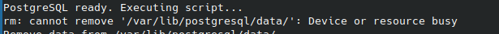

<a name="readme-top"></a>

<div align="center">

<a href="https://github.com/jesusalbujas/postgres_replication">  </a>

# Replicación de Base de Datos PostgreSQL
Este repositorio ofrece y detalla dos configuraciones de despliegue utilizando Docker Compose y PostgreSQL 13 para implementar la replicación de bases de datos PostgreSQL. El método empleado es replicación en streaming, que permite transferir datos de forma continua desde el servidor principal (master) hacia los servidores secundarios (esclavos), asegurando la sincronización en tiempo real. 
</div>

## Despliegues Docker Compose

Este repositorio define dos despliegues, siendo [`postgres13-master`](https://github.com/jesusalbujas/postgres_replication/tree/main/postgres13-master) el despliegue principal que albergará las bases de datos.

Por otro lado, contamos con [`postgres13-slave`](https://github.com/jesusalbujas/postgres_replication/tree/main/postgres13-slave), que actúa como el servidor esclavo encargado de recibir y replicar los cambios realizados en el servidor master (**postgres13-master**).

<p align="right">(<a href="#readme-top">volver arriba</a>)</p>

## ¿Cómo se realiza el levantamiento de los servicios?

A continuación, se describen detalladamente los pasos necesarios para configurar y poner en marcha el entorno de replicación PostgreSQL, asegurando el correcto funcionamiento del Master y el Esclavo.

### Parte 1 - Master

Para iniciar el Master, dirígete al directorio `postgres13-master`. En este paso, es necesario modificar el archivo pg_hba.conf.

Al final del archivo, se debe agregar o modificar una línea para permitir que el esclavo se conecte al maestro. Por ejemplo:

> [!TIP]
> Para conocer la IP de tu equipo, utiliza el comando:
> ```ip addr```

```conf
host replication postgres_replicator [IP_SERVER_SLAVE]/24  md5
```

> [!NOTE]
> Reemplaza [`IP_SERVER_SLAVE`] con la dirección IP del servidor esclavo. Esto asegura que el servidor maestro permita conexiones desde esa dirección para tareas de replicación.

En cuanto al archivo `postgresql.conf`, no es necesario modificarlo en esta ocasión, ya que está preconfigurado con los valores necesarios para la replicación. Los parámetros configurados son los siguientes:

```conf
listen_addresses = '*'
wal_level = replica
hot_standby = on
max_wal_senders = 10
max_replication_slots = 10
hot_standby_feedback = on
```

> [!WARNING]
> No modifiques el archivo postgresql.conf.

El archivo `initdb.sh` dentro del contenedor es el encargado de mover y configurar tanto el archivo `postgresql.conf` como el `pg_hba.conf`. Este script realiza las siguientes acciones:

- Crea usuarios necesarios:
  - El usuario `adempiere` con permisos de superusuario.
  - El usuario `postgres_replicator` con permisos de replicación.
- Realiza respaldos y movimientos:
  - Crea una copia del archivo original `postgresql.conf` como `old_postgresql.conf`.
  - Elimina el archivo original `postgresql.conf`.
  - Mueve los archivos personalizados `postgresql.conf` y `pg_hba.conf` desde `/tmp/postgresql/` al directorio de datos de PostgreSQL.
- Recarga la configuración:
  - Llama al comando `pg_reload_conf()` para aplicar los cambios sin necesidad de reiniciar el contenedor.

Una vez configurados los archivos, procede a levantar el Compose Master utilizando el siguiente comando:

```docker
docker compose up -d
```

<p align="right">(<a href="#readme-top">volver arriba</a>)</p>

### Parte 2 - Esclavo

Para iniciar el **Esclavo**, dirígete al directorio `postgres13-slave`. En este paso, es necesario modificar el archivo `initdb.sh` para configurar las credenciales de conexión con el **Master**.

```sh
MASTER_SERVER="IP_DEL_MASTER"
MASTER_PORT="PUERTO_DEL_MASTER"
```

El archivo `initdb.sh` es un script crucial para la configuración del entorno de replicación en **PostgreSQL**. Este script automatiza varias tareas necesarias para garantizar que el esclavo (replica) se configure correctamente y se conecte al maestro. A continuación, se detalla lo que hace:

- Crea usuarios necesarios:
  - El usuario `adempiere` con permisos de superusuario.
- Espera a que PostgreSQL esté disponible:
  - Utiliza un bucle para asegurarse de que el servicio de PostgreSQL esté listo antes de continuar con la ejecución.

- Respalda y limpia datos existentes:
  - Realiza una copia de respaldo del directorio original de datos de PostgreSQL en `/var/lib/postgresql/data_old`.
  - Elimina los datos existentes en `/var/lib/postgresql/data/` para preparar el directorio para la sincronización.\
- Sincroniza los datos con el maestro:
  - Utiliza `pg_basebackup` para copiar los datos desde el servidor maestro al esclavo.
  - Configura automáticamente los archivos necesarios para que el esclavo se conecte al maestro y comience la replicación.

Con este script, el esclavo queda configurado para conectarse al maestro y realizar la replicación de manera continua.

Una vez configurados los archivos, procede a levantar el Compose Slave utilizando el siguiente comando:

```docker
docker compose up -d
```

<p align="right">(<a href="#readme-top">volver arriba</a>)</p>

## ¿Cómo valido la conexión entre ambos servicios?

Para ello vamos al directorio en `conf` dentro de `postgres13-master`. Allí se encuentra un script que se encarga de ello. 

Se ejecuta de esta manera:

```bash
bash valid_replica_slot.sh
```

Al ejecutarlo, proporciona información sobre el estado del slot de replicación. La columna `active` devuelve `t` si el slot de replicación está activo, o `f` en caso contrario.

> [!WARNING]
> No modificar el nombre del contenedor.

### Q&A

1. Se levanta el contenedor pero el log arroja un mensaje que no se está realizando el **pg_basebackup** ¿Qué puedo hacer?.



- Para ello, se recrea el contenedor Esclavo ejecutando:

```shell
docker compose down && docker compose up -d
```

2. No se está conectando los servicios ¿por qué?.

- Seguir el paso a paso para su correcta conexión
- Validar la IP ingresada en el **pg_hba.conf**
- Validar las credenciales ingresadas en el script `initdb.sh`.
